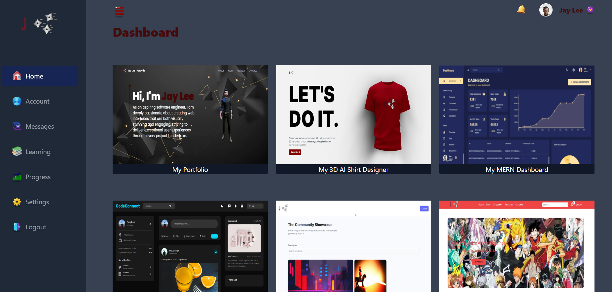

# Dashboard
This is a Next.js dashboard that showcases some of my completed projects. The dashboard is fully responsive and can be viewed on desktop and mobile devices.

## Technologies Used
The dashboard is built using the following technologies:

Next.js - a React framework for building server-side rendered web applications
Tailwind CSS - a utility-first CSS framework for rapidly building custom designs
React Icons - a collection of popular icons as React components

### Getting Started
To get started with the dashboard, follow these steps:

1. Clone the repository:
git clone https://github.com/7Jay-Lee7/ProjectDashboard.git

2. Install the dependencies:
cd dashboard
npm install

3. Run the development server:
npm run dev

4. Open the dashboard in your web browser:
http://localhost:3000/

### Features
The dashboard has the following features:

* A landing page that showcases some completed projects
* A responsive layout that adjusts to different screen sizes
* A navigation bar that allows users to switch between different pages

### Contributing
If you find a bug or have a feature request, please create an issue or submit a pull request.
